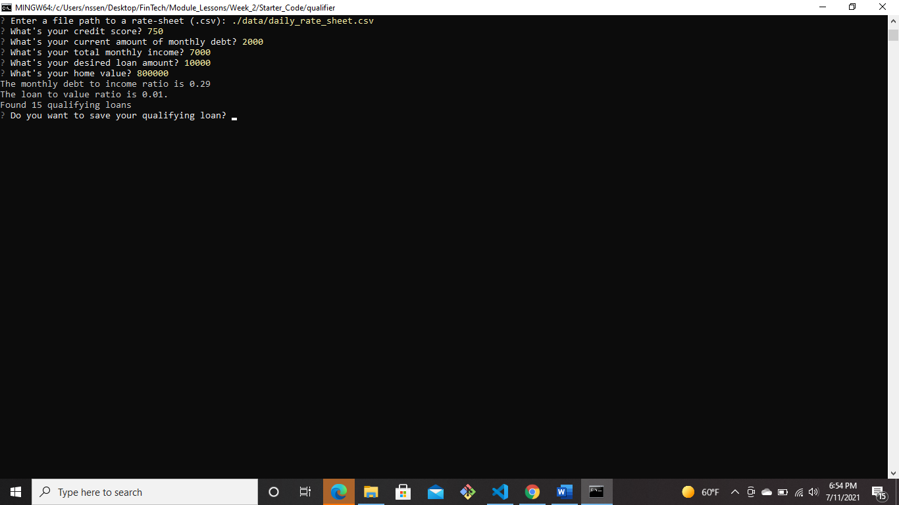

# Loan Qualifier Calculator

A one-stop-shop to see which banks will qualify you for a loan. The calulations are based on pre-set criteria from each bank. You simply enter your information to see which bank's criteria you match. This takes out the guess work. It also makes it easy to switch out information that may change throughout your life and see it's effects on your qualifiaction status. You can easily keep track of your info by saving it to a file.

---

## Technologies

This prodject uses Python 3.7 with the following packages:
* ### **fire** - To allow interaction with the command line interface
* ### **questionary** - To allow prompting the user for input
* ### **pathlib and Path** - To make a clear path between files and coding application
* ### **sys** - Access certain useful variables and functions
* ### **csv** - To format file imported and saved

---

## Installation Guide

First, install the following:
    
    pip install fire
    pip install questionary

Then import the following:
    
    import csv
    import sys
    from pathlib import Path
    import questionary
    import fire

---

## Usage

To use the Qualifier Calculator clone the repository, run in command line, follow prompts and answer questions. After you are given the number of banks you qualify for you'll be asked if you want to save this information to a file. 

---

## Contributors

A.Nansamba Ssensalo
[LinkedIn](www.linkedin.com/in/a-nansamba-ssensalo)

---

## License

